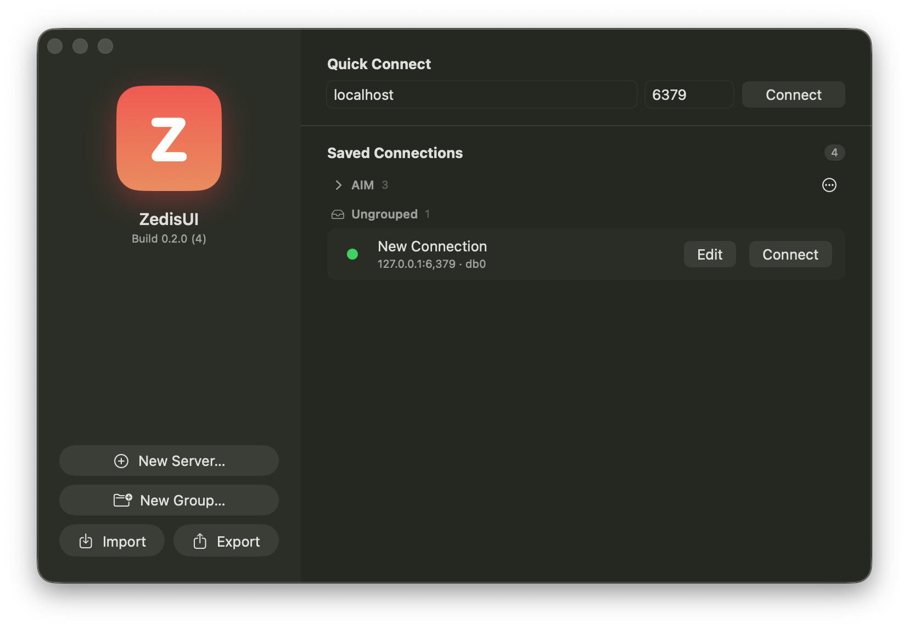
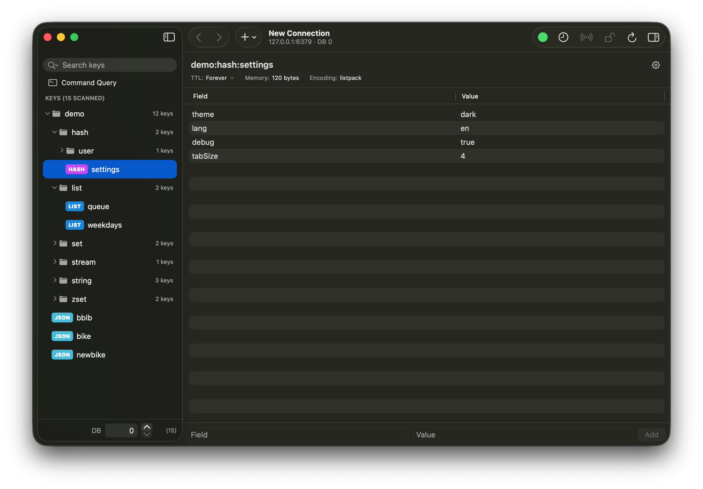
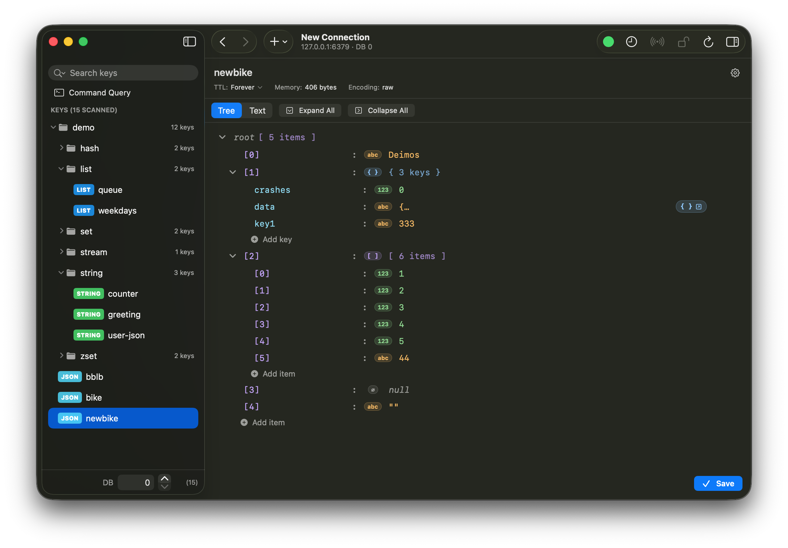
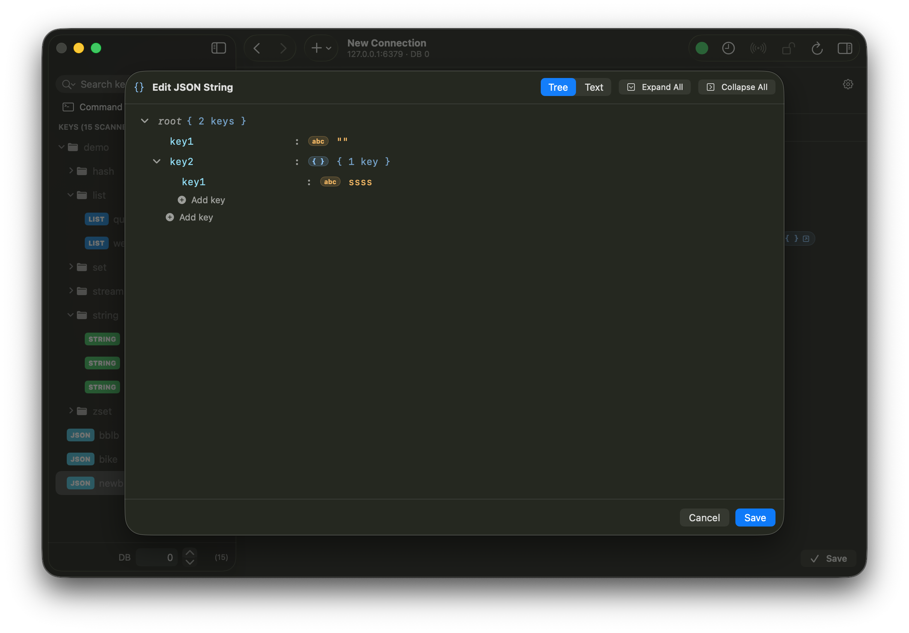
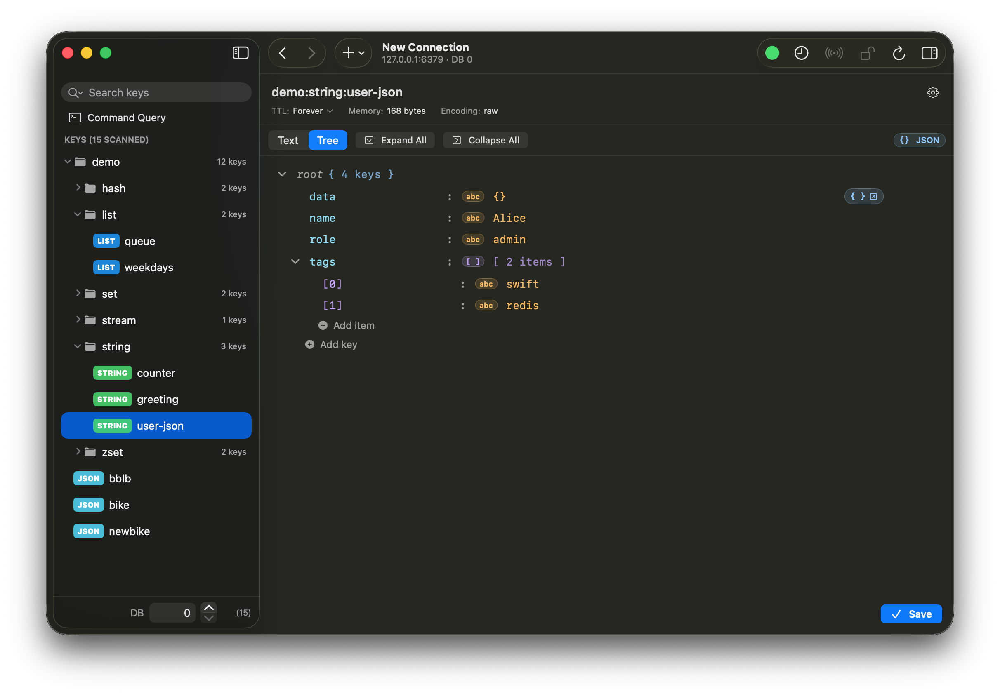

# ZedisUI

A native macOS Redis client, built in SwiftUI for macOS 15+. Aiming for
feature parity with [Medis](https://getmedis.com/) — multi-window,
multi-connection, type-aware key editing, inline command terminal.

> Status: early. v0.1.1 beta is out
> ([releases](https://github.com/xVanTuring/ZedisUI/releases)). The
> core flow works end-to-end; known gaps and follow-ups are tracked in
> [`TODO.md`](TODO.md).

## Screenshots

| | | |
|:---:|:---:|:---:|
|  |  |  |
|  |  | |

## Features

### Connections
- Save multiple connection profiles, password kept in Keychain
- Redis 6+ ACL: username + password auth
- **SSH tunnel** — host / port / username, password or private-key
  auth (with optional passphrase). All key formats and modern signature
  algorithms (`rsa-sha2-256/512`, `ed25519`) supported because the
  tunnel shells out to the system `/usr/bin/ssh`.
- Quick-connect (one-off) and saved profiles
- Test Connection from the dialog, including via the tunnel

### Sessions
- One window per active connection; sessions persist across launches
- Multi-DB switching via an editable number field + stepper (handles
  the full 256-DB range, unlike a menu picker)
- Back / forward navigation through the keys you've visited (`⌘[` /
  `⌘]`)
- Connection status pill in the toolbar; **Detail** opens a separate
  window with a structured `INFO` snapshot — server, memory, clients,
  stats, keyspace breakdown
- Reconnect / disconnect / error banner all surface inline
- Connection error banner with one-click reconnect

### Key browsing
- Sidebar tree groups keys by `:` prefix (Medis-style)
- **Substring search by default** — typing `foo` becomes `MATCH *foo*`;
  power users can still type `foo:*` for a literal glob
- Type filter via the search field's magnifier menu
- TTL editor (popover with seconds / minutes / hours / days)
- Rename, copy key name, delete (with confirmation on the toolbar)

### Type-aware editors
| Type | View / edit |
| --- | --- |
| String | Plain text editor with inspector preview |
| List | LRANGE viewer, append / replace / remove by index |
| Set | SMEMBERS viewer, SADD / SREM, rename via SREM+SADD |
| Hash | HGETALL table, HSET / HDEL |
| Sorted Set | ZRANGE w/ scores, ZADD / ZREM |
| Stream | XRANGE read-only viewer; XADD via "Add entry…" sheet, XDEL |

The right-side inspector mirrors the focused row across all editable
types (hash field, list index, set member, zset member, string preview).

### Terminal / command query
- Inline Command Query mode in the detail pane — issue arbitrary Redis
  commands against the current session, with quoted-arg tokenizing
- Per-session command history window (`⌘…` shortcut), capped to 1000
  entries so a busy SCAN session doesn't blow up memory

### Misc
- Native macOS chrome — `NSSearchField` in the toolbar (with type-filter
  menu), `NavigationSplitView` + `.inspector` for the panes,
  `WindowGroup(for: Connection.self)` so each session / history /
  detail window survives Cmd-W and reopens by value
- Hardened Runtime + App Sandbox on (`network.client`,
  `network.server`, `files.user-selected.read-write` entitlements
  only)
- Demo data seeder — `+` menu → "Fill Demo Data" populates `demo:*`
  across every type incl. Stream, idempotent

## Install

Download the latest release zip from
[**Releases**](https://github.com/xVanTuring/ZedisUI/releases), unzip,
drag `ZedisUI.app` into `/Applications`, and double-click to launch.

Builds are signed under team `T8F5T6HKG8` and notarized + stapled —
Gatekeeper accepts them on first launch without right-click → Open.

### Requirements
- macOS 15 (Sequoia) or later
- Apple silicon or Intel — the binary is universal

## Build from source

Prereqs: Xcode 16+, [XcodeGen](https://github.com/yonaskolb/XcodeGen)
(`brew install xcodegen`).

```sh
xcodegen
xcodebuild -project ZedisUI.xcodeproj -scheme ZedisUI \
    -configuration Debug -derivedDataPath DerivedData build
open DerivedData/Build/Products/Debug/ZedisUI.app
```

Codebase guide for contributors lives in [`CLAUDE.md`](CLAUDE.md) —
architecture, state ownership, SwiftUI gotchas that were debugged the
hard way.

## Release process

Automated by [`release.sh`](release.sh). See
[`docs/release.md`](docs/release.md) for the one-time setup
(Developer ID cert, `notarytool` keychain profile, `gh` auth) and the
per-step breakdown.

```sh
./release.sh 0.1.2                       # stable
./release.sh 0.2.0 --prerelease beta     # prerelease
```

## License

Not yet decided.
